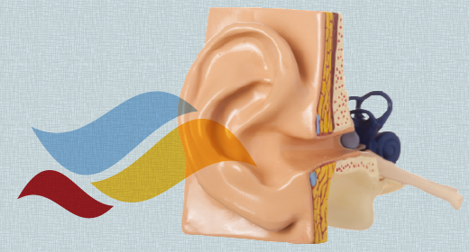

<article id="about_modified">
  

    

      

        

          <h1>
            Hearing Industry Research Consortium
          </h1>
          

            The purpose of the Hearing Industry Research Consortium is to develop and direct a non-competitive, mutually agreed upon research agenda that benefits the hearing aid industry, its customers, and end-users.
          

          

          

          <a href="#requests" class="button featured animate">
            <view>
              Requests for Proposals
            </view>
          </a>
        

      

      

        

          <ul style="height: 280px;" class="slides">
            <li style="width: 100%; float: left; margin-right: -100%; display: none;">
              
            </li>
            <li style="width: 100%; float: left; margin-right: -100%; display: list-item;">
              
            </li>
          </ul>
        

      

    

    

      <h2>
        Here’s How We Pursue Our Purpose
      </h2>
    

    

      

        

          
        

        <h4>
          Identify
        </h4>
        

          Identifying non-competitive research topics, initiating requests for proposals (RFPs) in topic areas, and funding appropriate proposals
        

      

      

        

          
        

        <h4>
          Support
        </h4>
        

          Supporting Educational Initiatives (e.g. research conferences)
        

      

      

        

          
        

        <h4>
          Create
        </h4>
        

          Co-authoring Research Consortium position papers and conference presentations
        

      

      

        
        
        
        
        
        
      

      <h2>
        Who We Are
      </h2>
      

        

          
        

        <h4>
          Andrew Dittberner
        </h4>
        

          
        

      

      

        <h4>
          
          <brent>
            Edwards
          </brent>
        </h4>
        

          
        

      

      

        <h4>
          
          <graham>
            Naylor
          </graham>
        </h4>
        

          
        

      

    

    

      

        <h4>
          
          <joel>
            Beilin
          </joel>
        </h4>
        

          
        

      

      

        <h4>
          
          <lars>
            Sunesen
          </lars>
        </h4>
        

          
        

      

      

        <h4>
          
          <stefan>
            Launer
          </stefan>
        </h4>
        

          
        

        

          &nbsp;
        

      

    

  

</article>
 
<article id="news" class="dark">
  

    

      <h2 class="remove-bottom">Latest News</h2>
      <h6 class="subheader"></h6>
    

    <ul class="display-posts-listing">
      <li class="listing-item"><a class="title" href="single.html">RFP 2013 Perception of dynamic spatial listening scenarios</a>
        (6/10/2013)-
        Dear colleagues, The hearing aid industry’s largest manufacturers have collaborated to create the Hearing Industry Research Consortium (IRC) to develop and direct a non-competitive, mutually agreed upon research agenda benefitting the hearing aid industry, its customers, and end users. The IRC is requesting proposals for a research project on “Perception of dynamic spatial listening scenarios”. […]
      </li>
      <li class="listing-item"><a class="title" href="single.html">Announcing the First IRC Grant Recipients</a>
        (5/17/2013)-
        The Hearing Industry Research Consortium (IRC) is excited to announce the results of its first public Request For grant Proposals (RFP). Piers Dawes, Ph.D, Research Fellow at the University of Manchester, and Andrea Pittman, Ph.D., Associate Professor at Arizona State University, were selected to each receive $150,000 for their research proposals that are aimed to […]
      </li>
      <li class="listing-item"><a class="title" href="single.html">Worldwide Hearing Industry Research Consortium Announced</a>
        (9/4/2012)-
        $300,000 Grant to be Awarded to Winning Proposal on Interaction of Cognition and Hearing Aids The hearing industry’s largest manufacturers have collaborated to create the Hearing Industry Research Consortium (IRC) to develop and direct a non-competitive, mutually agreed upon research agenda benefitting the hearing aid industry, its customers and end users. As its first act, […]
      </li>
      <li class="listing-item"><a class="title" href="single.html">Industry Research Consortium has a new website</a>
        (7/11/2012)-
        The hearing industry research consortium has a new website to support industry-wide research initiatives.
      </li>
    </ul>
    
<a href="news.html">View All News</a>
    

  

</article>
<article id="requests" class="">
  

    

      <h2 class="remove-bottom">Recent Requests for Proposals</h2>
      <h6 class="subheader"></h6>
    

    

      

        

        <h3>Download and read the Request for Proposal document.</h3>
        <h3>After reading the RFP document, please download and fill out the IRC Research Grant Application Form&nbsp;and <a href="mailto:contact@hearingirc.com" id="contact-link">email</a> it to us.</h3>
        
&nbsp;

        

          <table width="100%" border="0" cellpadding="7">
            <tbody>
              <tr>
                <td class="lyf_td_icons" width="16">
                  
                </td>
                <td class="lyf_td_filename"><a href="http://hearingirc.com/requests/Research%20Grant%20Application%20Form%20rev2013b.doc" target="_blank">Research Grant Application Form rev2013b.doc</a>
                </td>
                <td class="lyf_td_size">72.5 KB</td>
              </tr>
              <tr>
                <td class="lyf_td_icons" width="16">
                  
                </td>
                <td class="lyf_td_filename"><a href="http://hearingirc.com/requests/RFP%202013%20Perception%20of%20dynamic%20spatial%20listening%20scenarios.doc" target="_blank">RFP 2013 Perception of dynamic spatial listening scenarios.doc</a>
                </td>
                <td class="lyf_td_size">47.0 KB</td>
              </tr>
            </tbody>
          </table>
        

      

    

  

</article>
<article id="contact" class="dark">
  

    

      <h2 class="remove-bottom">Contact Us</h2>
      <h6 class="subheader"></h6>
    

    

      If you have any questions or need to get in touch, use the form below or <a title="Contact Us" href="mailto:contact@hearingirc.com">email</a> us.
      

      <form method="post" class="send-with-ajax">
        

          

            <label for="form-name">Your Name
            required
            </label>
          

          

            <input type="text" name="name" id="form-name" placeholder="Your Name" required="required">
          

        

        

          

            <label for="form-email">Your Email
            email required
            </label>
          

          

            <input type="email" name="email" id="form-email" placeholder="your@email.com" required="required">
          

        

        

          

            <label for="form-message">Message</label>
          

          

            <textarea name="message" id="form-message"></textarea>
          

        

        

          <button type="submit">Submit Form</button>
          

        

      </form>
    

    

      <a href="mailto:contact@hearingirc.com">contact@hearingirc.com</a>
       
    

  

</article>
